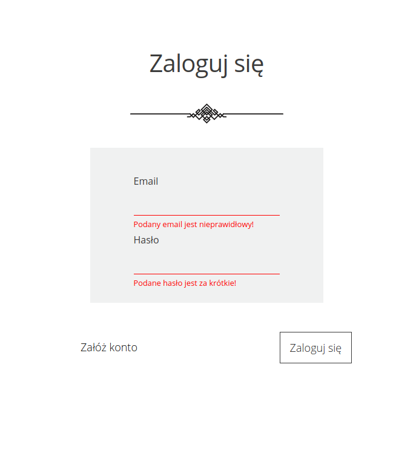
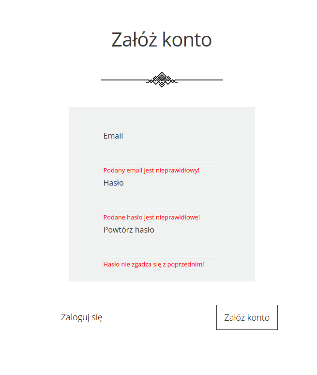

# Oddam w dobre ręce
## Start Helping Application

### Description
An app, which you can use to donate your old books, games, clothes etc. to others.

You can register and login to your own account, where you fill a form. There you can choose what you can give to other, how many bags you will use to pack the things, choose a city or organization/fundation, choose who you want to help and write your address with details for a courier. Every filled form is saved in the firebase database. You can also check your own statistics, how many bags you gave and how many organizations you supported. 
 
### Technologies:
- HTML5
- SASS
- React

### Additional dependencies: 
- Node Sass
- React Router Dom
- React Burger Menu
- React Scroll
- React Styled Select
- Styled Components
- Firebase

### Installation:

-  ```git clone https://github.com/Cenora6/Start-Helping-App.git``` to clone the repository
- ```npm install``` to install all dependencies
- ```npm start``` and ```http://localhost:3000/``` in the browser to preview the app :)

### Preview

> Main view 

 
 
 
 
 

> Login and Register with validation

 
 

> Form and view after Login

 


> Mobile version


